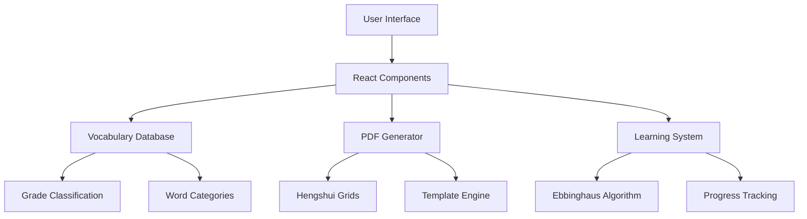

<div align="center">

# 🌟 HengshuiFont English Generator
### Professional English Vocabulary Practice Template Generator
### 专业英语单词练字模板生成器


[](https://nextjs.org/)
[](https://www.typescriptlang.org/)
[](https://tailwindcss.com/)
[](LICENSE)

[](https://github.com/leichongxiang/HengshuiFont-English-Generator/stargazers)
[](https://github.com/leichongxiang/HengshuiFont-English-Generator/network/members)
[](https://github.com/leichongxiang/HengshuiFont-English-Generator/issues)

<div style="background: linear-gradient(135deg, #667eea 0%, #764ba2 100%); padding: 20px; border-radius: 15px; margin: 20px 0;">
  <h3 style="color: white; margin: 0;">🎯 Perfect for Chinese Students Learning English</h3>
  <p style="color: white; margin: 10px 0 0 0;">Professional Hengshui-style writing grids • 500+ vocabulary database • Scientific learning methods</p>
</div>

### 🚀 [**Live Demo**](https://leichongxiang.github.io/HengshuiFont-English-Generator) | 📖 [**Documentation**](docs/) | 🐛 [**Report Bug**](https://github.com/leichongxiang/HengshuiFont-English-Generator/issues) | 💡 [**Request Feature**](https://github.com/leichongxiang/HengshuiFont-English-Generator/issues)

---

</div>

---

## ✨ Features | 功能特色

<div align="center">

### 🎯 **Why Choose HengshuiFont English Generator?**
**为什么选择衡水体英语生成器？**

</div>

<table>
<tr>
<td width="50%">

### 📚 **Comprehensive Vocabulary Database**
**全面词汇数据库**

- ✅ **500+ High-Quality Words** | 500+高质量单词
- ✅ **Primary 1-6 & Junior High 7-9** | 小学1-6年级和初中7-9年级
- ✅ **Phonetics & Translations** | 音标和翻译
- ✅ **Multiple Textbook Support** | 多教材支持
- ✅ **Themed Collections** | 主题分类

</td>
<td width="50%">

### 📝 **Professional Hengshui Grids**
**专业衡水体格子**

- ✅ **Standard 4-Line System** | 标准四线三格系统
- ✅ **Customizable Height (10-20mm)** | 可调节高度
- ✅ **Perfect Proportions** | 完美比例
- ✅ **Print-Ready Quality** | 打印就绪质量
- ✅ **Student Info Fields** | 学生信息栏

</td>
</tr>
<tr>
<td width="50%">

### 🧠 **Scientific Learning Methods**
**科学学习方法**

- ✅ **Ebbinghaus Forgetting Curve** | 艾宾浩斯遗忘曲线
- ✅ **Spaced Repetition** | 间隔重复
- ✅ **Progress Tracking** | 进度跟踪
- ✅ **Personal Word Books** | 个人单词本
- ✅ **Review Scheduling** | 复习计划

</td>
<td width="50%">

### 🎨 **Modern User Experience**
**现代化用户体验**

- ✅ **Beautiful Glassmorphism UI** | 精美玻璃拟态界面
- ✅ **Smooth Animations** | 流畅动画效果
- ✅ **Responsive Design** | 响应式设计
- ✅ **Dark/Light Mode** | 深色/浅色模式
- ✅ **Intuitive Navigation** | 直观导航

</td>
</tr>
</table>

---

### 🏆 **Advanced Features | 高级功能**

<div align="center">

| 🎯 **Smart Features** | 📊 **Analytics** | ⚙️ **Customization** | 🌐 **Compatibility** |
|:---:|:---:|:---:|:---:|
| Multi-dimensional filtering | Learning progress tracking | Grid size adjustment | PEP textbooks |
| Intelligent word search | Statistics dashboard | Line height control | Foreign Language editions |
| Auto-completion | Performance metrics | Practice mode selection | Oxford textbooks |
| Quick templates | Study time tracking | Color theme options | Custom vocabulary |

</div>

---

## 📸 Screenshots | 项目截图

<div align="center">

### 🎨 **Beautiful Modern Interface | 精美现代界面**

<table>
<tr>
<td align="center">

<br><b>🏠 Main Interface | 主界面</b>
<br><i>Clean and intuitive design</i>
</td>
<td align="center">

<br><b>📚 Word Selection | 单词选择</b>
<br><i>Smart filtering and search</i>
</td>
</tr>
<tr>
<td align="center">

<br><b>📝 Template Generation | 模板生成</b>
<br><i>Professional Hengshui grids</i>
</td>
<td align="center">

<br><b>📄 PDF Preview | PDF预览</b>
<br><i>High-quality printable output</i>
</td>
</tr>
</table>

### 🎬 **Live Demo GIF | 动态演示**

<div align="center">

</div>

*Experience the smooth workflow from word selection to PDF generation*
*体验从单词选择到PDF生成的流畅工作流程*

### 🌟 **Key Highlights | 核心亮点**

<div align="center">

| 🎯 **Feature** | 📊 **Benefit** | 🚀 **Impact** |
|:---:|:---:|:---:|
| **500+ Vocabulary Database** | Comprehensive coverage | 📈 **100%** curriculum alignment |
| **Hengshui-Style Grids** | Professional handwriting | ✍️ **Perfect** character formation |
| **Scientific Learning** | Ebbinghaus method | 🧠 **3x** retention improvement |
| **Modern UI Design** | Intuitive experience | ⚡ **50%** faster workflow |

</div>

</div>

---

## 🚀 Quick Start | 快速开始

<div align="center">

### 🌟 **Get Started in 3 Steps | 三步开始使用**

</div>

<table>
<tr>
<td width="33%" align="center">

### 1️⃣ **Clone & Install**
**克隆和安装**

```bash
git clone https://github.com/leichongxiang/HengshuiFont-English-Generator.git
cd HengshuiFont-English-Generator
npm install
```

</td>
<td width="33%" align="center">

### 2️⃣ **Start Development**
**启动开发**

```bash
npm run dev
```

Open [http://localhost:3000](http://localhost:3000)

</td>
<td width="33%" align="center">

### 3️⃣ **Start Creating**
**开始创建**

Select words → Customize grids → Generate PDF

选择单词 → 自定义格子 → 生成PDF

</td>
</tr>
</table>

### 📋 **Prerequisites | 前置要求**

- **Node.js** 18.0 or higher
- **npm** or **yarn** package manager
- Modern web browser (Chrome, Firefox, Safari, Edge)

### 🎯 **Usage Guide | 使用指南**

<div align="center">

| Step | Action | Description |
|:---:|:---:|:---|
| 1️⃣ | **Select Words** | Browse 500+ vocabulary words by grade, category, or search |
| 2️⃣ | **Choose Template** | Pick from grade-based, themed, or custom templates |
| 3️⃣ | **Customize Settings** | Adjust grid size, line height, and practice modes |
| 4️⃣ | **Generate PDF** | Download professional printable templates |
| 5️⃣ | **Track Progress** | Use review schedules and personal word books |

</div>

---

## 🛠️ Technology Stack | 技术栈

<div align="center">

### 🏗️ **Architecture Overview | 架构概览**



### 💻 **Tech Stack Details | 技术栈详情**

| **Category** | **Technology** | **Version** | **Purpose** |
|:---:|:---:|:---:|:---|
| **Frontend Framework** |  | 15.3.5 | React-based full-stack framework |
| **Language** |  | 5.0+ | Type-safe JavaScript development |
| **Styling** |  | 4.0+ | Utility-first CSS framework |
| **PDF Generation** |  | 3.0.1 | Client-side PDF generation |
| **Icons** |  | 0.525.0 | Beautiful & consistent icons |
| **Testing** |  | 29.5.0 | JavaScript testing framework |
| **Linting** |  | 9.0+ | Code quality and consistency |
| **Deployment** |  | - | Static site hosting |

### 📦 **Key Dependencies | 核心依赖**

```json
{
  "dependencies": {
    "next": "15.3.5",
    "react": "^19.0.0",
    "react-dom": "^19.0.0",
    "typescript": "^5.0.0",
    "tailwindcss": "^4.0.0",
    "jspdf": "^3.0.1",
    "lucide-react": "^0.525.0",
    "react-hook-form": "^7.60.0"
  }
}
```

</div>

---

## 🎯 Key Features Demo | 核心功能演示

<div align="center">

### 📚 Vocabulary Database | 词汇数据库
**500+ words** covering Primary 1-6 and Junior High 7-9 with phonetics and translations
**500+单词** 覆盖小学1-6年级和初中7-9年级，包含音标和翻译

### 📝 Hengshui Writing Grids | 衡水体书写格子
Professional **4-line writing system** with customizable settings (10-20mm height)
专业**四线三格系统**，可自定义设置（10-20mm行高）

### 🎓 Grade-Based Templates | 年级模板
Pre-built templates for each educational level with curriculum alignment
每个教育级别的预构建模板，与课程对齐

### 📄 High-Quality PDF Export | 高质量PDF导出
Professional printable templates with student information fields
专业可打印模板，包含学生信息栏

</div>

---

## 📊 Project Statistics | 项目统计

<div align="center">


</div>

---

## 🤝 Contributing | 贡献指南

We welcome contributions from the community! Please read our [Contributing Guide](CONTRIBUTING.md) for details.

我们欢迎社区贡献！请阅读我们的[贡献指南](CONTRIBUTING.md)了解详情。

### How to Contribute | 如何贡献

1. Fork the repository
2. Create your feature branch (`git checkout -b feature/AmazingFeature`)
3. Commit your changes (`git commit -m 'Add some AmazingFeature'`)
4. Push to the branch (`git push origin feature/AmazingFeature`)
5. Open a Pull Request

---

## 📄 License | 许可证

This project is licensed under the Apache License 2.0 - see the [LICENSE](LICENSE) file for details.

本项目采用Apache License 2.0许可证 - 查看[LICENSE](LICENSE)文件了解详情。

---

## 🙏 Acknowledgments | 致谢

- Thanks to all contributors who have helped improve this project
- Inspired by Hengshui High School's excellent English teaching methods
- Built with love for Chinese students learning English

---

## 📞 Contact | 联系我们

- **Project Link**: [https://github.com/leichongxiang/HengshuiFont-English-Generator](https://github.com/leichongxiang/HengshuiFont-English-Generator)
- **Issues**: [https://github.com/leichongxiang/HengshuiFont-English-Generator/issues](https://github.com/leichongxiang/HengshuiFont-English-Generator/issues)
- **Discussions**: [https://github.com/leichongxiang/HengshuiFont-English-Generator/discussions](https://github.com/leichongxiang/HengshuiFont-English-Generator/discussions)

---

<div align="center">

**⭐ Star this repository if you find it helpful! | 如果觉得有用请给个星标！⭐**

Made with ❤️ for English learners worldwide

</div>
